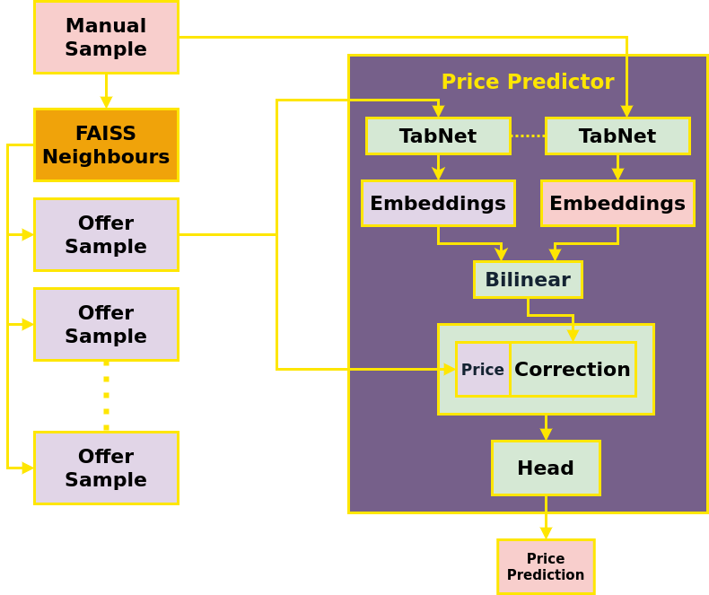

# Raifhack-DS-2021
https://raifhack.ru/ - Команда Звёздочка

# Siamese TabNet

Сиамская TabNet предсказывает стоимость объекта недвижимости с price_type=1, принимая на вход его признаки, признаки другого объекта недвижимости с price_type=0 и его стоимость. Подбор опорных объектов осуществляется через FAISS по географическим координатам. Модель пока не дотюнили, лучший скор около 2.1.

# Использование
1. Положить данные в папку `./data`
2. `poetry install`
3. `poetry run python siamese-tabnet.py` обучит модель и создаст предсказания в `./data`.
